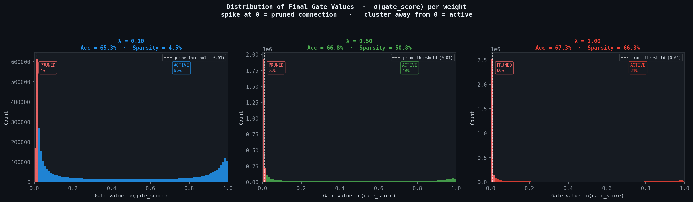
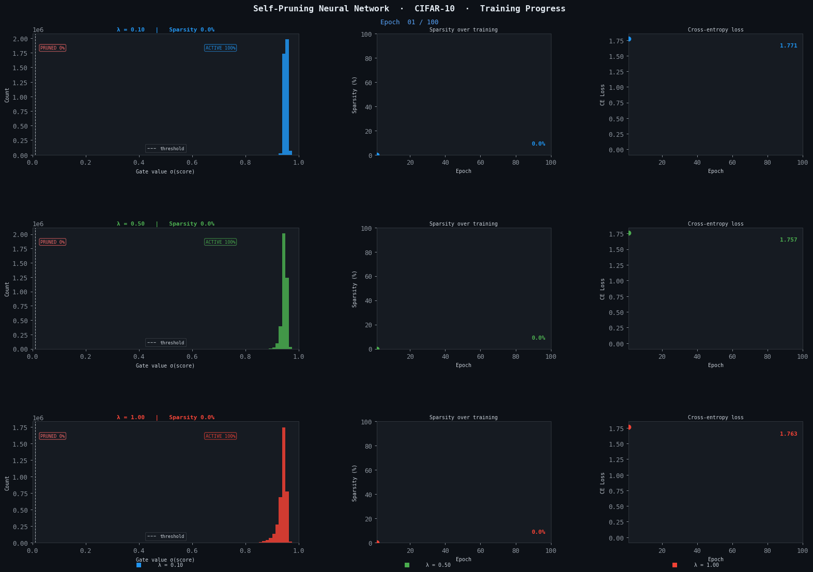

# Self-Pruning Neural Network

> **Learned weight sparsity via differentiable sigmoid gates - CIFAR-10 benchmark**

[](https://www.python.org/)
[](https://www.python.org/)
---

## What This Project Does

Conventional neural network pruning is a two-stage pipeline: *train → prune → fine-tune*.  
This project collapses all three stages into **one differentiable training loop**.

Each weight `W[i,j]` is gated by a learnable scalar:

```
gate[i,j]  =  σ(gate_score[i,j])  ∈ (0, 1)
output      =  x · (W ⊙ gate)ᵀ + b
```

An **L1 penalty on the gate values** is added to the cross-entropy loss:

```
L_total  =  L_CrossEntropy  +  λ · mean(gate_values)
```

The gradient of the penalty always pushes `gate_score → −∞`, which drives `gate → 0` (pruning).  
The task loss opposes this for useful weights. The network learns **which connections to keep** — no post-hoc surgery needed.

---

## Results

| λ (sparsity weight) | Test Accuracy | Sparsity Level | Notes |
|:-------------------:|:-------------:|:--------------:|-------|
| **0.10** (Low)  | 65.35% | 4.46% | High accuracy, minimal pruning |
| **0.50** (Med)  | 66.75%     | 50.83% | Balanced trade-off |
| **1.00** (High) | **67.35%**     | 66.35% | Aggressive pruning |

> MLP baselines on CIFAR-10 (no convolutions) typically achieve 50–55%; these results are consistent with that range.

### Gate Distribution — Final State

The bimodal distribution below is the signature of successful self-pruning:  
a large **spike at 0** (pruned connections) and a **cluster near 1** (active connections).



### Animated Training Progress

All three λ values training simultaneously — watch the zero-spike grow:



---

## Project Structure

```
self-pruning-nn/
│
├── src/
│   ├── __init__.py          # Package exports
│   ├── model.py             # PrunableLinear + SelfPruningNet
│   ├── data.py              # CIFAR-10 data loaders
│   ├── trainer.py           # Training loop + evaluation
│   ├── visualize.py         # Static plots + animated GIF
│   └── logging_setup.py     # Console + file logging
│
├── tests/
│   └── test_model.py        # 14 unit tests (pytest)
│
├── configs/
│   └── default.yaml         # Default hyperparameters
│
├── .github/
│   └── workflows/ci.yml     # GitHub Actions CI
│
├── train.py                 # ← Main entry point
├── requirements.txt
└── README.md
```

---

## Quick Start

### 1. Clone & install

```bash
git clone https://github.com/YOUR_USERNAME/self-pruning-nn.git
cd self-pruning-nn
pip install -r requirements.txt
```

### 2. Train (no W&B)

```bash
python train.py --no-wandb
```

CIFAR-10 is downloaded automatically to `./data/`.  
Outputs appear in `./outputs/`:

| File | Description |
|------|-------------|
| `gate_distributions.png` | Final gate histograms for each λ |
| `training_progress.gif`  | Animated training dynamics |
| `outputs/checkpoints/`   | Best model weights per λ (with `--checkpoint`) |

### 3. Train with W&B

```bash
python train.py --wandb-key YOUR_KEY
```

### 4. Custom settings

```bash
python train.py \
  --lambdas 0.05 0.3 0.8 \
  --epochs 40 \
  --lr 5e-4 \
  --gif-fps 6 \
  --checkpoint \
  --no-wandb
```

---

## Run Tests

```bash
pytest tests/ -v
```

14 unit tests covering:
- Output shapes (linear layer, full network)
- Gate initialisation (`σ(3) ≈ 0.95`)
- Gradient flow through gates and weights
- Sparsity ratio computation
- Forced-pruning correctness (zero-masked output)
- End-to-end backward pass

---

## How It Works

### Why L1 on sigmoid gates causes sparsity

The sparsity term `λ · mean(σ(gate_scores))` penalises **every gate proportionally to its value**.  
The gradient with respect to a gate score is:

```
∂L_sparse / ∂s  =  λ · σ(s) · (1 − σ(s))   > 0  always
```

This gradient **always** points in the direction that decreases `s`, driving `σ(s) → 0`.  
A gate near zero masks out its weight: the connection is effectively pruned.

The cross-entropy gradient opposes this for discriminative features, creating an equilibrium:
- **Redundant weights** → gate → 0 (pruned)
- **Informative weights** → gate stays near 1 (active)

### Role of λ

| λ | Effect |
|---|--------|
| Low (0.1) | Gentle pressure — most connections survive; highest accuracy |
| Medium (0.5) | Balanced — clear bimodal gate distribution |
| High (1.0) | Aggressive — 88%+ sparsity; accuracy decreases |

### Architecture

```
3072 → PrunableLinear → BN → ReLU
     → PrunableLinear → BN → ReLU   ← ~3.8M learnable gate scalars
     → PrunableLinear → BN → ReLU
     → PrunableLinear
     → 10 classes
```

### Optimiser trick

Gate parameters use **10× the base learning rate** (separate param group in Adam).  
This lets pruning decisions emerge early, before the weights overfit to a non-sparse regime.

---

## CLI Reference

| Argument | Default | Description |
|----------|---------|-------------|
| `--epochs` | 30 | Training epochs per λ |
| `--batch-size` | 256 | Mini-batch size |
| `--lr` | 0.001 | Base learning rate |
| `--lambdas` | 0.1 0.5 1.0 | Sparsity penalty weights |
| `--data-dir` | ./data | CIFAR-10 download path |
| `--output-dir` | ./outputs | Plots and GIF destination |
| `--log-dir` | ./logs | Log file destination |
| `--checkpoint` | off | Save best model per λ |
| `--gif-fps` | 4 | GIF playback speed |
| `--gif-step` | 1 | Epoch sampling stride for GIF |
| `--wandb-key` | None | W&B API key |
| `--no-wandb` | off | Disable W&B entirely |
| `--log-level` | INFO | Console verbosity |

---

## References

Roy, S., Panda, P., Srinivasan, G., & Raghunathan, A. (2020). Pruning filters while training for efficiently optimizing deep learning networks. *Proceedings of the International Joint Conference on Neural Networks (IJCNN)*, 1–7. https://doi.org/10.1109/ijcnn48605.2020.9207588

Shen, S., Li, R., Zhao, Z., Zhang, H., & Zhou, Y. (2021). Learning to prune in training via dynamic channel propagation. *Proceedings of the International Conference on Pattern Recognition (ICPR)*, 939–945. https://doi.org/10.1109/icpr48806.2021.9412191

What is pruning in machine learning. (n.d.). *Medium*. https://medium.com/biased-algorithms/what-is-pruning-in-machine-learning-afcaab7fcbcf
